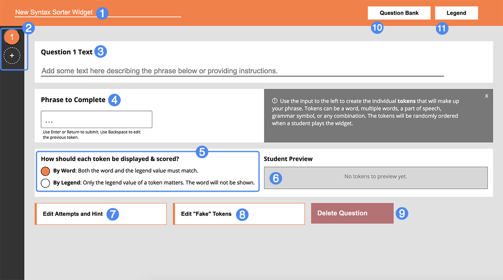
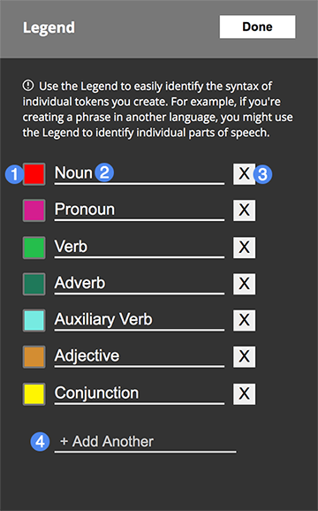
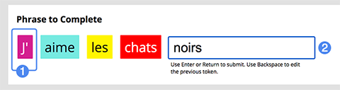
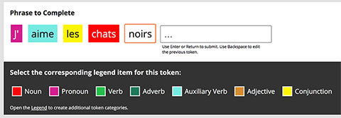
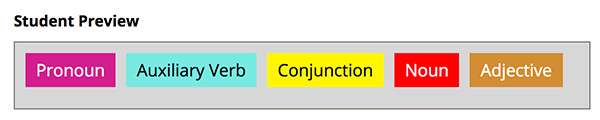
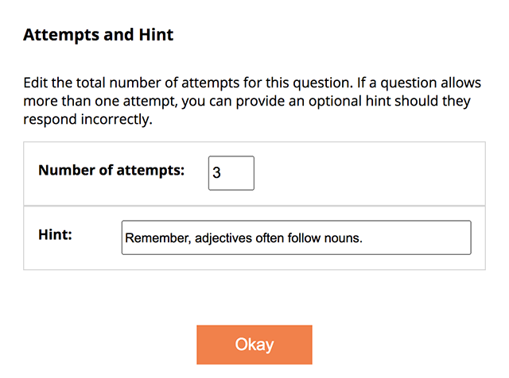
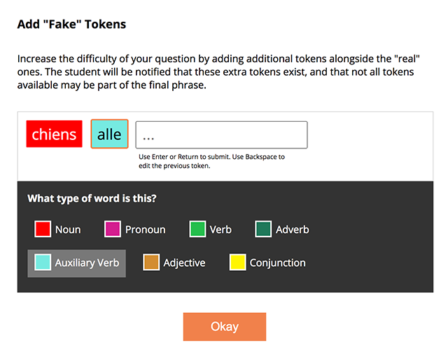
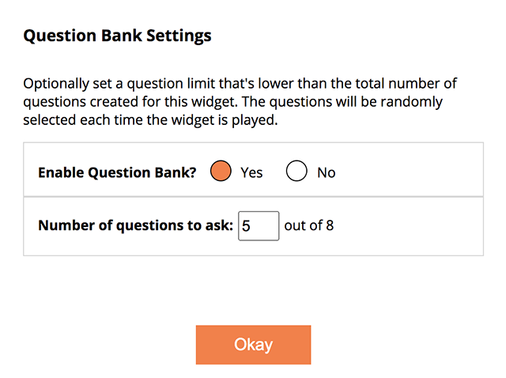

## Overview ##

Syntax Sorter lets you create powerful syntax mastery tools by creating sentences or phrases, tokenizing them, and categorizing them based on a legend you create. Students are tasked with arranging the tokens in the proper order. You can choose to display tokens by both their word *and* legend value or simply the legend value each word represents.

1. Set the widget title
2. Question navigation
3. Provide a question, prompt, or explanatory text for this particular question
4. Question phrase builder
5. Token display settings
6. Live student preview
7. Set the number of attempts and provide an optional hint for this question
8. Create additional "fake" tokens for this question
9. Delete this question
10. Question bank settings
11. Legend

## Details ##

### Defining The Legend ###

Before creating individual phrases and tokenizing them, your first stop should be the **Legend** (11). It's the heart of the Syntax Sorter widget and allows you to define what each token represents.

1. Legend definition color (click to change)
2. Legend definition name
3. Delete this particular legend definition
4. Add a new legend definition

Within the Legend, it's up to you to create the range of possible token categories. If you're teaching another language, for example, these categories may represent individual parts of speech: nouns, verbs, pronouns, and so on.

<aside>
	Important: the Legend is the same for all questions in your widget. You won't define the legend separately for each question: rather, tokens in each question's phrase will all use the same set of definitions.
</aside>

Each legend definition should be accompanied by a unique color. Students will use this color to identify the corresponding legend definition when they play your widget. Colors are randomly generated for each definition when you create it; you can select the color swatch to change it to a color of your choosing.

### Building a Phrase ###

1. A completed token
2. Token input

Use the **Phrase Builder** to construct your phrase for each question. Create a token by entering a word, multiple words, part of speech, grammar symbol, or any combination - then hit **Enter** or **Return** to tokenize your input.

Once you've created a new token, **select the token** to display the legend selection drop-down, where you'll select what legend definition this token belongs to. Every token requires a corresponding legend type.

Use **Backspace** to convert previous tokens back into inputs, allowing you to edit or delete them.

<aside>
	Remember, the phrase you create here represents the correct arrangement of its component tokens. These tokens will be arranged randomly when a student interacts with your widget - it's up to them to put the tokens in the proper order! 
</aside>

### Token Display Preference ###

Tokens are displayed to the student in one of two ways:

- By Word: the token is displayed **as-is** to the student. The student will use the token's **word content** and **legend value** when deciding how to arrange it relative to other tokens.
- By Legend: Only the token's **legend value** is visible. For example, a token comprised of the word "Cat" and the legend value "Noun" will only be displayed as "Noun" with its corresponding color. **The word value is not visible and does not affect scoring**. If you have multiple tokens of the value "Noun", any of them can be used in a position where "Noun" would be correct.

The **Student Preview** allows you to better understand how tokens will appear to the student when they play your widget:

In this example, the token display preference is **By Legend**. The word content is not shown; only the legend value of each token.

<aside>
	The token display preference is per-question You can freely alternate between questions. It's up to you!
</aside>

### Additional Settings: Attempts, Fake Tokens, and Question Bank ###

#### Attempts and Hint ####

The Attempts and Hint dialog (7) allows you to set the number of submission attempts a student is granted for each question. By default, the attempt limit is 1. Students will be able to submit their arrangement up to this limit before being locked into that choice.

The **optional hint** is available for any question with an attempt limit **higher than 1.** If a student submits an arrangement that is incorrect, the hint is displayed alongside the question.

#### "Fake" Tokens ####

The "Fake" Token dialog (8) provides a way to increase the difficulty of a question by adding "fake" tokens to your phrase. These tokens will be added to the shuffled set of "real" tokens for the question. **Students will be notified that not every token present may be part of the final phrase.**

The "Fake" token builder works the same way as the actual phrase builder. Tokenize your input by pressing **Enter** or **Return** and then select the token to identify its corresponding legend value. Like the "real" tokens, all "fake" tokens **must** have an associated legend value.

Note that a **fake token isn't automatically incorrect if used**. If your display preference is **By Legend** and you have a "real" token of value "Noun" and a "fake" token of value "Noun", either token will be correct when placed in the correct position. Unlike before, however, you now have two "Noun" tokens instead of one.

#### Question Bank Settings ####

The Question Bank dialog lets you limit the total number of questions a student must complete to a value lower than the total number of questions you've created in your widget. For example, if you have a widget with 8 total questions, but only want students to complete 5 in a given play of the widget, you can use this dialog to set that limit. When enabled, the questions are chosen randomly from the total set, meaning each time a student plays your widget, the set of provided questions will be different, and randomly arranged.

### Scoring ### 

Unlike many other Materia widgets, students are prompted to check each of their answers prior to visiting the score screen, up to the limit set for each question. **The entire arrangement must be correctly ordered** for students to receive credit for a particular question. Keep this in mind when considering if you should build particularly long, complicated phrases that students must correctly arrange, or when providing too many additional "fake" tokens to confuse them.