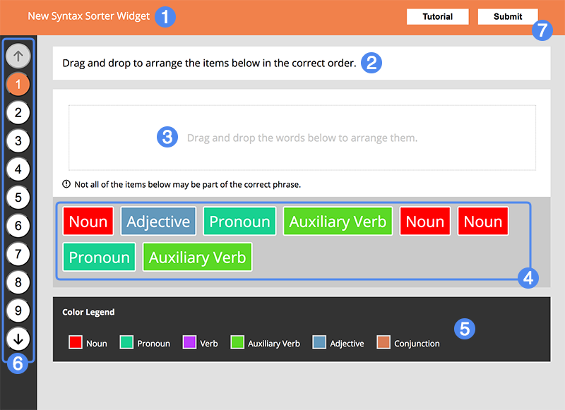
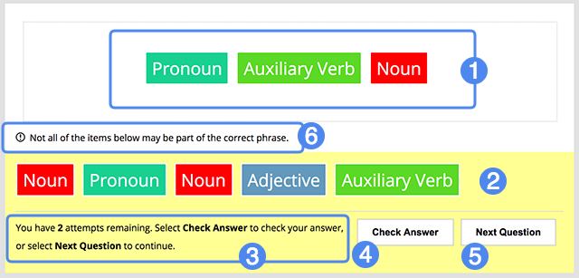

## Overview

Syntax Sorter tasks students with identifying individual syntax elements of a phrase or sentence and arranging them in the proper order. For example, syntax elements may represent parts of speech of another language, or control structures of a computer program.

1. Widget title
2. Question, prompt, or instructions
3. Token drop zone
4. Phrase tokens to be arranged
5. Token legend
6. Question navigation
7. Submit for scoring

### Details ###

For each question in a Syntax Sorter widget, read the question, prompt, or instructions at the top (2). Then, drag and drop each token (4) onto the drop zone (3) in the order you think they should be arranged. You can pick up and rearrange tokens whenever you wish. Right-clicking a token in the drop zone will return it to the collection of unsorted tokens.

When you've completed arranging the tokens, select **Check Answer** to verify whether the arrangement is correct.

1. Arranged tokens
2. Unsorted tokens
3. Feedback/Status, including remaining attempts
4. Check your answer
5. Paginate to the next question
6. "Fake" token notification: **Note: this will only be present when additional, "fake" tokens are used for the question
7. Submit your widget for scoring

### Feedback ###

The Feedback/Status section (3) will inform you of your remaining attempts for this particular question. Under normal circumstances, this section will not be displayed until all tokens are arranged. However, if "fake" tokens are in use for a particular question, this section will become visible once any token is placed in the drop zone.

<aside>
	Remember, if "fake" tokens are in use, you don't necessarily have to arrange all tokens present, and doing so may result in an incorrect answer.
</aside>

Questions with multiple attempts will allow you to alter your token arrangement after checking your answer, should it be incorrect. You may also be provided with an **optional hint** after an incorrect submission if the question has one.

Use the **Next Question** button or the pagination controls on the left (5) to move to the next question, or go back to previous questions. When you reach the final question, you will be prompted to click **Submit** at the top-right (7).